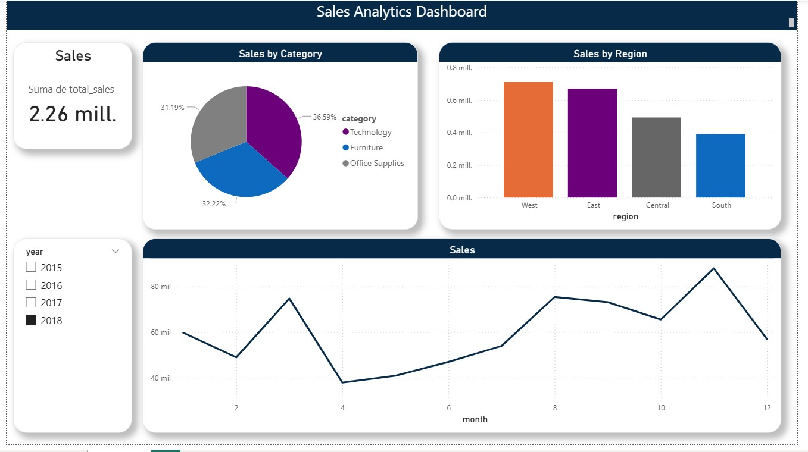

# End-to-End Sales Data Lake

## Project Overview

This project implements an **end-to-end Data Engineering pipeline** using a **Medallion Architecture (Bronze, Silver, Gold)** to process sales data and generate analytics-ready datasets.

The pipeline ingests raw data, processes it with **Apache Spark**, applies transformations and data quality checks, and produces curated analytical tables consumed by a **Power BI dashboard**.

This project simulates a **modern Data Lake architecture used in real-world analytics platforms**.

---

# Architecture

The project follows a **Medallion Data Lake Architecture**.

Raw Data  
↓  
Bronze Layer (Raw ingestion)  
↓  
Silver Layer (Cleaned and standardized data)  
↓  
Gold Layer (Business-ready aggregated tables)  
↓  
Power BI Dashboard

---

# Data Layers

### Raw
- Original source data (CSV files)
- No transformations applied

### Bronze
- Raw ingestion into the Data Lake
- Stored as **Parquet files**
- Schema preserved from source

### Silver
- Data cleaning and transformations
- Date parsing and normalization
- Data type corrections
- Data quality validation

### Gold
- Aggregated analytical datasets
- Optimized for BI consumption
- Used by dashboards and analytics tools

---

# Tech Stack

| Technology | Purpose |
|---|---|
Python | Data pipeline development |
Apache Spark (PySpark) | Distributed data processing |
Parquet | Efficient columnar storage |
Apache Kafka | Streaming ingestion simulation |
Hive | Metadata catalog |
Power BI | Business Intelligence dashboards |
Git | Version control |


---

# Data Pipeline Workflow

### Raw → Bronze
- Ingest CSV sales dataset
- Store raw data in Parquet format

### Bronze → Silver
- Data cleaning
- Schema normalization
- Date parsing
- Data quality checks

### Silver → Gold
- Business aggregations
- Creation of analytical datasets:
  - Sales by Region
  - Sales by Category
  - Sales by Month

---

# Analytics Layer

The **Gold Layer** feeds a Power BI dashboard used for business analytics.

The dashboard includes:

- Sales by Region
- Sales by Category
- Sales Trend over Time
- Interactive filtering

---

# Dashboard Preview




---

# Running the Pipeline

## 1 Activate the virtual environment

Linux / WSL

```bash
source venv-linux/bin/activate
```

## 2 Run the pipeline

```bash
python orchestration/run_pipeline.py
```

Raw → Bronze
Bronze → Silver
Silver → Gold

# Logs

Pipeline execution logs are stored in:
/
Pipeline execution logs are stored in:

# Author
Rodrigo Torres
